# БАЗЫ ДАННЫХ. СИСТЕМЫ УПРАВЛЕНИЯ БАЗАМИ ДАННЫХ

Здесь я кратко и понятно расскажу о базах данных. Не сильно развернуто, но понятно, чтобы иметь общее представление, а
за подробностями надо идти в документацию.

## Содержание

- [Основы работы с БД](#Основы-работы-с-БД)
- [Лучшие практики управления базами данных](#Лучшие-практики-управления-базами-данных)
- [Нормализация баз данных](#Нормализация-баз-данных)
- [Как работают реляционные базы данных](#Как-работают-реляционные-базы-данных)
- [Оператор JOIN](#Оператор-JOIN)
- [Оператор GROUP BY](#Оператор-GROUP-BY)
- [Виды СУБД](#Виды-СУБД)
    - [СУБД](#СУБД)
    - [SQL](#SQL)
    - [NoSQL](#NoSQL)
    - [Особенности](#Особенности)
- [Индексы](#ИНДЕКСЫ)
    - [Упрощенная схема устройства БД](#Упрощенная-схема-устройства-БД)
    - [Теперь конкретно про индексы](#Теперь-конкретно-про-индексы)
    - [Создание индекса](#Создание-индекса)
    - [Как узнать цену запроса](#Как-узнать-цену-запроса)
    - [Составные индексы](#Составные-индексы)
    - [Кардинальность поля](#Кардинальность-поля)
    - [Практические советы](#Практические-советы)
    - [Простые индексы](#Простые-индексы)
    - [Необходимость и избыточность](#необходимость-и-избыточность)
    - [Основы работы с explain](#Основы-работы-с-explain)
- [Ограничения](#Ограничения)
    - [NOT NULL](#NOT-NULL)
    - [UNIQUE](#UNIQUE)
    - [PRIMARY KEY](#PRIMARY-KEY)
    - [FOREIGN KEY](#FOREIGN-KEY)
    - [Практические советы](#Практические-советы-1)
- [Автоматизация](#Автоматизация)
    - [Последовательности](#Последовательности)
    - [Представления](#Представления)
    - [Хранимые процедуры](#Хранимые-процедуры)
    - [Триггеры](Триггеры)
- [b-tree](#b-tree)
- [Миграции](#Миграции)
- [Теорема CAP](#Теорема-CAP)
- [Архитектура Postgres](#Архитектура-Postgres)

---

## Основы работы с БД

[К оглавлению...](#Содержание)

Для начала работы нужно:

- Подключиться к базе
- Подтвердить свои права доступа

Подключение клиентов к БД:

- у каждого клиента своё соединение
- у каждого соединения свой процесс
- выгоднее всего, когда соединений мало, но при этом они живут долго

Пул соединений с БД:

- даёт переиспользовать соединения

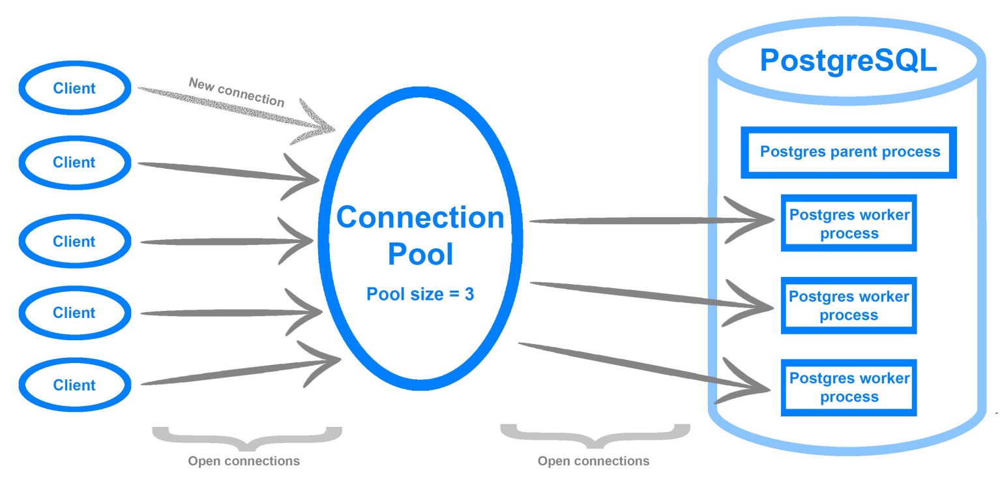

Получить список соединений:

```sql
SELECT
  state,
  query
FROM 
  pg_stat_activity
WHERE 
  state IS NOT NULL;
```

- `active` — соединение прямо сейчас что-то делает
- `idle` — соединение открыто и ожидает запросы
- `idle in transaction` — соединение открыто в режиме транзакции

Как раздавать права:

- создаём роль "Аналитика" (к примеру, умеет только читать)
- создаём роль "API" (умеет записывать и читать)<br>
  Выигрыш: если нужно изменить права — вносим правки в одном месте

Принцип минимальных привилегий:

- по умолчанию запрещаем всё
- открываем только нужные доступы

## Лучшие практики управления базами данных

[К оглавлению...](#Содержание)

- **Лучшая практика 1**: нам нужно обращаться с базой данных приложения и справочными данными в ней как с обычным кодом.
  Это означает, что мы должны хранить как его схему, так и справочные данные (справочники) в системе управления
  версиями.
- **Лучшая практика 2**: мы должны явно сохранять каждое изменение в схеме базы данных и в эталонных данных. Это
  означает, что для каждой модификации, которую мы делаем, мы должны создать отдельный SQL-скрипт с изменениями.
- Лучшая практика 3: каждый файл сценария SQL должен быть неизменным после его развертывания в рабочей или промежуточной
  среде.
- **Лучшая практика 4**: все изменения в схеме базы данных и справочных данных должны применяться через сценарии. Ни
  один из них не может быть применен вручную.
- **Лучшая практика 5**: версия базы данных должна храниться в самой базе данных. Например, для `db-migrate` - это
  таблица `mogrations`

---

## Нормализация баз

[К оглавлению...](#Содержание)

**Нормализация БД** заключается в приведении структуры хранения данных к нормальным формам (NF). Всего таких форм
существует 8, но часто достаточным является соблюдение первых трех.

Для чего: чтобы улучшить их целостность, гибкость и масштабируемость, а так же уменьшить дублирование информации и
устранить аномалии, которые могут привести к неправильным или неоднозначным результатам в запросах.

### Первая нормальная форма

Основным правилом первой нормальной формы (1NF) является необходимость неделимости значения в каждом поле (столбце)
строки – атомарность значений

Помимо атомарности к первой нормальной форме относятся следующие правила:

- Строки таблиц не должны зависеть друг от друга, т.е. первая запись не должна влиять на вторую и наоборот, вторая на
  третью и т.д.
- Аналогичная ситуация со столбцами записей. Их порядок не должен влиять на понимание информации.
- Каждая строка должна быть уникальна, поэтому для нее определяется первичный ключ, состоящий из одного либо нескольких
  полей (составной ключ). Первичный ключ не может повторяться в пределах таблицы и служит идентификатором записи.

Небольшой пример пример:
Была ненормализованная таблица  


А так она выглядит после приведения в 1-ую нормальную форму  
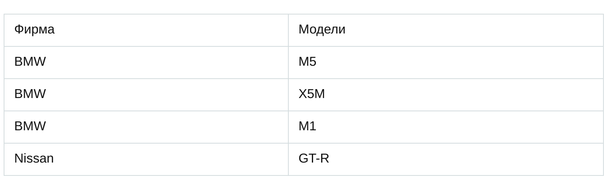

### Вторая нормальная форма

2-я нормальная форма (2NF) требует, чтобы каждая таблица была нормализована в 1NF, и каждый не-ключевой атрибут был
зависим от всех компонентов ключа. То есть если первичный ключ состоит из нескольких столбцов, то не-ключевые столбцы
должны зависеть от ВСЕХ ключевых столбцов, входящих в первичный ключ. Зависимость от только от части ключевых столбцов -
это не правильно

### Третья нормальная форма

- 3-я нормальная форма (3NF) требует, чтобы каждая таблица была нормализована в 2NF и каждый не-ключевой атрибут не
  зависел ни от каких других не-ключевых атрибутов.
- 3-я нормальная форма (3NF) гарантирует, что все данные в таблице зависят только от первичного ключа и не зависят друг
  от друга.

3NF схожа по логике с 2NF, но с некоторым отличием. Если 2 форма ликвидирует зависимости неключевых полей от части
ключа, то третья нормальная форма исключает зависимость неключевых полей от других неключевых полей.

Вот хороший пример таблицы, которая не приведена в 3-нормальную форму:  
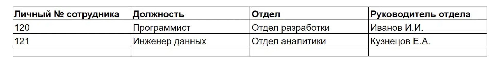  
Личный номер сотрудника — это первичный ключ. Данные во втором и третьем столбце напрямую зависят от первичного ключа.
Но между личным номером сотрудника и руководителем отдела только косвенная или транзитивная связь. Её в базе данных
третьей нормальной формы быть не должно <br>
Данные о руководителях нужно вынести в отдельную таблицу, так как это поле никак не зависит от первичного ключа (личный
номер сотрудника)

---

## Как работают реляционные базы данных

[К оглавлению...](#Содержание)

### Временная сложность

Временная сложность - это мера количества времени, необходимого для выполнения определенного алгоритма или решения
задачи.

Временная сложность может быть выражена в терминах "O-нотации" (большое "О"). О-нотация описывает, как быстро растет
время выполнения алгоритма при увеличении размера входных данных. Например, алгоритм со временной сложностью O(1) будет
выполняться за постоянное время, в то время как алгоритм с временной сложностью O(n^2) будет выполняться за время,
пропорциональное квадрату размера входных данных.

Здесь важен не объём данных, а динамика увеличения количества операций с ростом объёма. Временная сложность не позволяет
вычислить точное количество, но зато представляет собой хороший способ оценки.

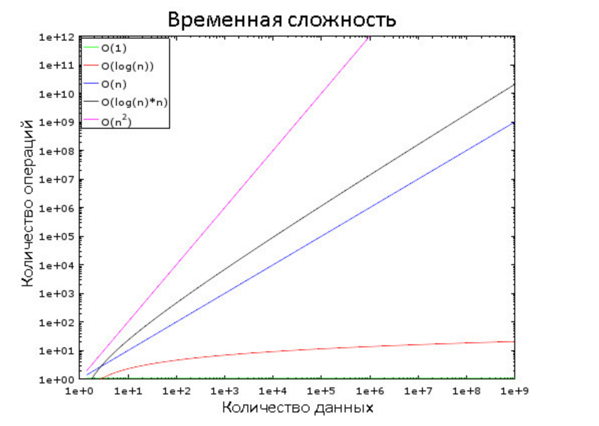

### Сортировка слиянием

Сортировка слиянием - это алгоритм сортировки, который использует метод "разделяй и властвуй". Алгоритм сортировки
слиянием позволяет эффективно сортировать массивы любого размера.

Преимущества:

- Гарантированная сложность O(n log n) - время работы алгоритма не зависит от расположения элементов в массиве.
- Устойчивость - порядок равных элементов не меняется.
- Эффективность на больших объемах данных - сортировка слиянием позволяет эффективно сортировать массивы любого размера.

Выполняется двумя фазами:

#### Фаза деления

  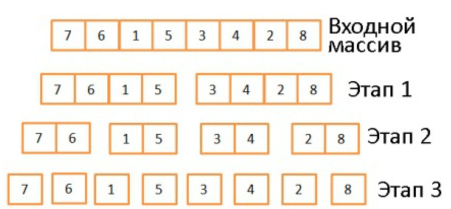

В три этапа исходный массив делится на подмассивы, состоящие из одного элемента. Вообще, количество этапов деления
определяется как log(N) (в данном случае N=8, log(N) = 3). Идея в том, чтобы на каждом этапе делить входящие массивы
пополам. То есть описывается логарифмом с основанием 2

#### Фаза сортировки

  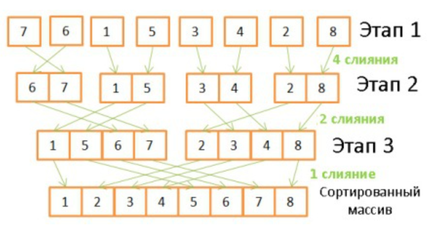

Здесь происходит обратная операция, объединение массивов с двукратным увеличением их размеров. Для этого требуется
проделать на каждом этапе по 8 операций.

1. Сначала в них сравниваются имеющиеся элементы
2. Наименьший из них переносится в новый массив
3. Происходит возврат в тот массив, откуда был взят предыдущий элемент
4. Шаги 1-3 повторяются до тех пор, пока в одном из исходных массивов не останется лишь один элемент
5. После этого из второго массива переносятся все оставшиеся элементы

```js
function mergeSort(arr) {
    if (arr.length <= 1) {
        return arr;
    }

    const middle = Math.floor(arr.length / 2);
    const left = arr.slice(0, middle);
    const right = arr.slice(middle);

    return merge(mergeSort(left), mergeSort(right));
}

function merge(left, right) {
    const result = [];

    while (left.length && right.length) {
        if (left[0] <= right[0]) {
            result.push(left.shift());
        } else {
            result.push(right.shift());
        }
    }

    while (left.length) {
        result.push(left.shift());
    }

    while (right.length) {
        result.push(right.shift());
    }

    return result;
}
```

Данный алгоритм хорошо работает лишь потому, что оба исходных массива были заранее отсортированы, поэтому ему не нужно
возвращаться в их начало во время очередной итерации.

https://habr.com/ru/company/vk/blog/266811/

---

## Оператор JOIN

#### INNER JOIN

Используется для объединения строк из двух таблиц на основе совпадения значений в указанных столбцах. Он возвращает
только те строки, которые имеют совпадающие значения в указанных столбцах из обеих таблиц.

Разберем на примерах. Создадим две таблицы и наполним их тестовыми данными:

```SQL
CREATE TABLE test_1
(
    test_1_id   INT,
    test_1_text TEXT
);

INSERT INTO test_1 (test_1_id, test_1_text)
VALUES (1, 'test-1-1'),
       (2, 'test-1-2'),
       (3, 'test-1-3');


CREATE TABLE test_2
(
    test_2_id   INT,
    test_2_text TEXT
);

INSERT INTO test_2 (test_2_id, test_2_text)
VALUES (3, 'test-3-1'),
       (3, 'test-3-2'),
       (4, 'test-4-2'),
       (5, 'test-5-3');
```

Получим вот это:

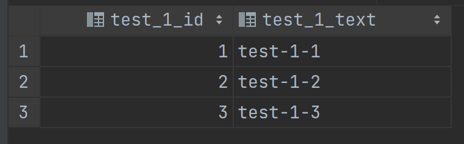 
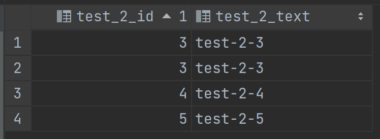

Давайте теперь поэкспериментируем с запросами:

Запрос

```SQL
SELECT *
FROM test_1 AS t_1
INNER JOIN test_2 t_2 ON t_1.test_1_id = t_2.test_2_id;
```

Вернет

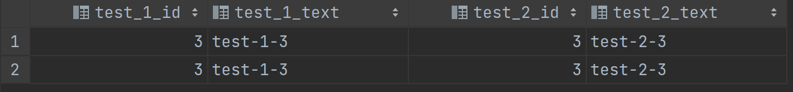

Сделаем выводы:

1. inner join возвращает только те строки, которые совпали по указанным столбцам
2. inner join возвращает строку для каждого совпадения. Т.е. если значение по указанному столбцу повторяется в любой из
   таблиц, для каждого такого повторения вернется строка

---

## Оператор GROUP BY

Возьмем таблицы из [предыдущего параграфа](#Оператор-JOIN)

Рассмотрим запрос

```SQL
SELECT
    t_1.test_1_id,
    t_1.test_1_text
FROM
    test_1 AS t_1
    INNER JOIN test_2 t_2 ON t_1.test_1_id = t_2.test_2_id
GROUP BY
    t_1.test_1_id;
```

Этот запрос вернет
ошибку: `ERROR: column "t_1.test_1_text" must appear in the GROUP BY clause or be used in an aggregate function`

В данном запросе используется оператор группировки GROUP BY, но не указаны агрегатные функции, такие как COUNT, SUM,
MAX, MIN и т.д. При использовании оператора GROUP BY, необходимо указать, какие функции применять к столбцам, которые не
участвуют в группировке.

В данном случае, если в таблице test_2 есть несколько строк с одним и тем же значением test_2_id, то оператор JOIN
приведет к дублированию строк в таблице (как мы видели выше), которые затем будут группироваться в итоговой выборке, что
может привести к неправильным результатам.

Чтобы исправить ошибку, надо либо добавить агрегатную функция к полям, не участвующим в GROUP BY, либо убрать из
выборки `t_1.test_1_text`;

ОДНАКО!
Если бы `test_1_id` и `test_2_id` были `PRIMARY KEY`, этой ошибки точно при таком же запросе бы не возникло. В этом
случае нет необходимости включать остальные столбцы в оператор GROUP BY, так как значения в этих столбцах уникальны для
каждой строки в таблицах `test_1` и `test_2`.

---

## Виды СУБД

СУБД (системы управления базами данных) можно разделить на 2 основные категории: SQL и NoSQL.

### SQL

SQL (Structured Query Language) СУБД хранят данные в таблицах со строго определенными столбцами и типами данных.
Поддерживаются связи между таблицами и высокоуровневые операции запросов.

### NoSQL

NoSQL (Not Only SQL) СУБД не используют таблицы и не имеют строгих ограничений на структуру данных. Они часто
используются для обработки больших объемов данных и имеют высокую гибкость.

### Особенности

SQL-базы данных используют реляционную модель данных, где данные хранятся в таблицах с фиксированными столбцами и
строками. Они поддерживают ACID-свойства (атомарность, целостность, изолированность и доступность) и предлагают высокую
степень контроля данных.

NoSQL-базы данных используют нереляционные модели данных, такие как документы, ключ-значение или графы. Они обеспечивают
гибкость и скорость в управлении данными, а также поддерживают высокую масштабируемость и доступность данных. Однако,
они не всегда поддерживают ACID-свойства.

---

## ИНДЕКСЫ

[К оглавлению...](#Содержание)

### Упрощенная схема устройства БД

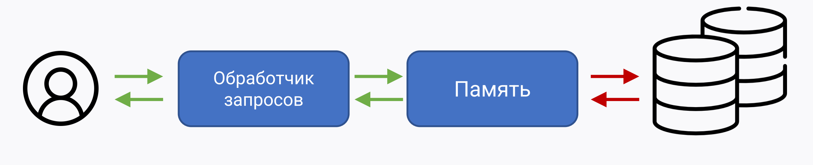

Бутылочное горлышко БД — это ввод-вывод. Надо стараться, чтобы обращений к диску было минимум

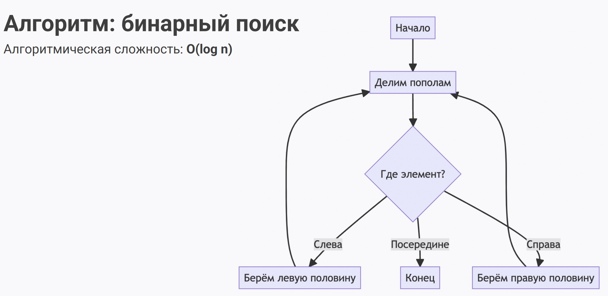

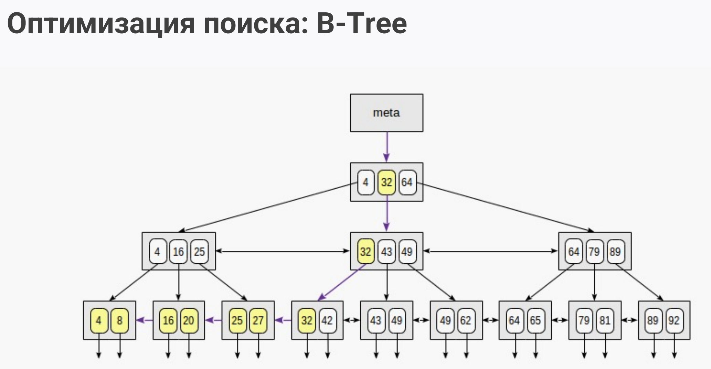

- Очень мало уровней
- Все результаты находятся на одном (нижнем) уровне и напрямую связаны между собой
- Это позволяет быстро искать как конкретные значения, так и диапазоны
- Алгоритмическая сложность: O(log n)

### Теперь конкретно про индексы

- нужны для повышения производительности чтения, сортировки, группировки…
- модифицируются при каждой операции INSERT, UPDATE, DELETE
- требуют дополнительного места на диске
- бывают нескольких разных видов (основной — B-Tree)

### Создание индекса

```sql
CREATE INDEX idx_offers_area
ON offers(area);
```

рекомендуется название вида idx_table_fields

### Как узнать цену запроса

```sql
EXPLAIN
SELECT name
FROM offers
WHERE area = 90;
```

- первое число cost – стоимость первой строки результата
- второе число cost – стоимость всех строк результата
- оценка даётся в условных единицах
- в ответе будет упомянут Index Scan (если нет, индекс не использовался)
- в ходе разработки можно сбрасывать кэш планировщика (для точности)

```sql
ANALYZE offers; 
```

### Составные индексы

- создаются сразу для нескольких полей
- в ряде случаев работают быстрее, чем несколько простых индексов
- могут "подхватываться" вместо простых индексов, если поля запроса находятся в левой части индекса*
- очень важно заранее подобрать нужный порядок полей в таком индексе

**Кардинальность** - Это то, насколько у нас много разных значений в столбце таблицы. Чем разнообразнее наши данные, тем
выше кардинальность.


- В настоящее время составными могут быть только индексы типов B-дерево, GiST, GIN и BRIN.
- Составные индексы по нескольким полям работают и отдельно для этих полей.
- Существуют частично-составные индексы. Для работы такого индекса необходимо передавать все поля, входящие в индекс.
  Отдельно работать не будут. Пример частично-составные индекса:

```sql
  "receipts_mt_id_chunk_id_ukey" UNIQUE, btree (transaction_id, chunk_id) WHERE chunk_id IS NOT NULL
  "receipts_mt_id_chunk_null_ukey" UNIQUE, btree (transaction_id) WHERE chunk_id IS NULL 
```

### Кардинальность поля

```sql
SELECT COUNT(DISTINCT region)
FROM offers;
```

**Составные индексы: порядок полей**:

- в начало ставим поля с высокой кардинальностью (много разных значений)
- в конец ставим поля, по которым нужен поиск по диапазону

**Как создать составной индекс?**

```sql
CREATE INDEX idx_offers_area_region
ON offers(area, region);
```

### Практические советы

- индексы дают максимальный выигрыш для полей с высокой кардинальностью (много разных значений)
- для небольших таблиц индексы обычно не нужны (и часто игнорируются)
- нужно периодически анализировать запросы и удалять индексы, если они не используются

Индексы ещё бывают:

- Покрывающие: Хранят в себе значения полей, нужных запросу
- Фильтрованные: Создаются по условию WHERE, экономят место
- По функциям: Упрощают поиск (например, lower())
- Полнотекстовые: Разбивают текст на слова

Индекс в базе данных - это структура данных, которая позволяет быстро и эффективно находить записи в таблице, используя
определенный ключ или набор ключей.  
Индексы нужны для ускорения запросов. С индексами системе не надо сканировать всю таблицу для поиска нужного
совпадения.  
PostgreSQL поддерживает несколько типов индексов: B-дерево, хеш, GiST, SP-GiST, GIN и BRIN. По умолчанию тип индекса
B-дерево.  
Индексы можно создавать и удалять в любое время.

### Простые индексы

Простой индекс - это индекс на одном столбце таблицы. Он используется для ускорения операций выборки данных, сортировки
и группировки по этому столбцу.

### Необходимость и избыточность

Использование индексов является необходимым, если таблица содержит большое количество данных и выполнение операций
выборки данных становится слишком медленным. Однако, создание избыточных индексов может привести к ухудшению
производительности базы данных, так как при изменении данных таблицы индексы также должны быть обновлены. Поэтому
необходимо тщательно анализировать, какие индексы нужны и на каких столбцах они должны быть созданы.

## Основы работы с explain

[К оглавлению...](#Содержание)

"EXPLAIN" - это команда в SQL, которая позволяет анализировать выполнение запросов к базе данных. Эта команда помогает
оптимизировать производительность запросов, исследуя, как база данных обрабатывает запросы и использует индексы.

Когда вы выполняете запрос с помощью EXPLAIN, база данных анализирует запрос и создает план выполнения. План выполнения

- это детальный список шагов, которые база данных должна выполнить, чтобы выполнить запрос. План выполнения включает
  информацию о том, какие индексы будут использоваться, какие таблицы будут объединены и в каком порядке, какие фильтры
  будут применены и многое другое.

Анализ плана выполнения позволяет идентифицировать узкие места в запросе и оптимизировать его. Например, вы можете
обнаружить, что база данных не использует нужный индекс или выполняет слишком много объединений таблиц, что замедляет
выполнение запроса. С помощью EXPLAIN можно понять, какие изменения необходимо внести в запрос, чтобы улучшить его
производительность.

```sql
EXPLAIN SELECT * FROM users WHERE age > 25;
```

Некоторые из наиболее распространенных параметров, которые можно использовать в команде EXPLAIN, включают в себя:

- ANALYZE: этот параметр позволяет базе данных фактически выполнить запрос и вернуть статистику о том, сколько строк
  было обработано для каждой операции в плане выполнения.
- VERBOSE: этот параметр добавляет дополнительную информацию в вывод команды EXPLAIN. Например, он может показывать,
  какие индексы используются для каждой операции, или какие фильтры применяются.
- COSTS: этот параметр показывает оценку стоимости каждой операции в плане выполнения. Стоимость измеряется в единицах "
  секунд на единицу работы", и она используется для определения наилучшего плана выполнения запроса.
- BUFFERS: этот параметр показывает, сколько блоков буфера было использовано для каждой операции в плане выполнения. Это
  позволяет оценить, сколько операций чтения/записи должна выполнить база данных для выполнения запроса.
- FORMAT: этот параметр позволяет выбрать формат вывода команды EXPLAIN. Например, вы можете выбрать формат JSON или
  YAML, чтобы легче обрабатывать вывод с помощью программного обеспечения. Кроме того, в зависимости от конкретной СУБД
  могут быть и другие параметры, которые можно использовать с командой

```sql
EXPLAIN ANALYZE SELECT * FROM mytable WHERE mycolumn = 'myvalue';
```

---

## Ограничения

[К оглавлению...](#Содержание)

### NOT NULL

- не даст добавить NULL-значения в это поле
- его рекомендуется сразу установить на все поля (кроме тех, где действительно нужен NULL)

```sql
CREATE TABLE coaches (
name VARCHAR(32) NOT NULL
);
```

### UNIQUE

- не даст добавить два одинаковых значения
- можно поставить сразу на несколько полей
- для него автоматически создаётся индекс
- несколько значений NULL считаются разными!

```sql
CREATE TABLE coaches (
name VARCHAR(32) NOT NULL,
email VARCHAR(32) UNIQUE
);
```

Кое-что о NULL

- Возьмем школьников
- Спросим у каждого про рост
- Два ответили ХЗ
- Означает ли это, что у них одинаковый рост (подсказка: ответ ХЗ)

NULL - это что-то вроде ХЗ. Поэтому два NULL не равны между собой: NULL != NULL -> true

### PRIMARY KEY

```sql
CREATE TABLE coaches (
name VARCHAR(32),
email VARCHAR(32),
PRIMARY KEY (name, email)
);
```

- можно поставить сразу на несколько полей
- эти поля становятся UNIQUE + NOT NULL
- в каждой таблице может быть не больше одного PK
- на практике чаще накладывается на суррогатное поле

### FOREIGN KEY

```sql
CREATE TABLE coaches (
name VARCHAR(32),
email VARCHAR(32),
user_id INTEGER REFERENCES users ON DELETE CASCADE,
PRIMARY KEY (name, email)
);
```

- гарантирует ссылочную целостность
- можно указать, что делать при изменении "родителя"
- не рекомендуется в highload-проектах (тогда целостность обеспечивается бэком)

### Практические советы

- установить PK / FK / NOT NULL / UNIQUE на стороне БД (база будет сама себя контролировать)
- для проектов под высокой нагрузкой минимизировать кол-во ограничений

## Автоматизация

[К оглавлению...](#Содержание)

### Последовательности

```sql
CREATE SEQUENCE my_sequence;
CREATE table people (
id INTEGER NOT NULL DEFAULT nextval('my_sequence'),
name VARCHAR(32) NOT NULL
);
```

- используются, когда нужна сквозная нумерация записей в нескольких таблицах
- могут быть только числовыми
- не гарантируют непрерывную и возрастающую нумерацию

### Представления

```sql
CREATE VIEW
my_view
AS
SELECT
```

- упрощают запросы, в т.ч. к нескольким таблицам
- служат "интерфейсом", реализацию которого можно менять
- при определённых условиях допускают UPDATE-операции
- их можно сделать материализованными (аналог кэша)

### Хранимые процедуры

- набор SQL-инструкций
- по сути — эквивалент функции или процедуры в традиционном программировании
- у каждой СУБД свой язык и свои нюансы

Плюсы:

- производительность, близость к данным

Минусы:

- сложнее разрабатывать и масштабировать

### Триггеры

- эквивалент подписки на события
- привязываются к событиям INSERT, UPDATE, DELETE…
- могут как дополнить событие, так и заменить его

## b-tree

[К оглавлению...](#Содержание)

[Визуализатор](https://www.cs.usfca.edu/~galles/visualization/BTree.html)
[Статья. Сделать на него краткий обзор](http://citforum.ru/database/advanced_intro/75.shtml)

---

## Миграции

[К оглавлению...](#Содержание)

Виды:

- Миграция структуры данных (столбцы, таблицы, индексы)
- Миграция данных: это перемещение данных из одной БД в другую, либо изменение формата данных, такого как изменение
  типов данных, конвертация кодировок и т.д.
- Миграция серверов: это перенос БД на новый сервер или изменение настроек сервера для улучшения производительности.
- Миграция в облако: это перенос БД из локальной инфраструктуры в облачное окружение.
- Миграция операционных систем: это перенос БД на новую операционную систему.

[Статья про миграцию данных с oracle на postgres яндекс.денег](https://habr.com/ru/company/yoomoney/blog/326998/)

## Теорема CAP

[К оглавлению...](#Содержание)

Определения:

### Транзакция

Транзакция - это последовательность операций, рассматриваемая базой данной как атомарное действие и завершающаяся
подтверждением изменений (`commit`) либо откатом изменений (`rollback`).

Транзакция обеспечивает:

- сохранение целостности данных
- параллельную работу пользователей с базой данных
- восстановление данных при откатах и сбоях

### ACID

- `Atomicity` (Атомарность) - либо все изменения транзакции фиксируются (commit), либо все откатываются (rollback).
- `Consistency` (Согласованность) - транзакции не нарушают согласованность данных, то есть они переводят базу данных из
  одного корректного состояния в другое.
- `Isolation` (Изолированность) - работающие одновременно транзакции не влияют друг на друга.
- `Durability` (Долговечность) - если транзакция была успешно завершена, то никакое внешнее событие не должно привести к
  потере совершенных ей изменений.

Реализации ACID:

- `ARIES` (Algorithms for Recovery and Isolation Exploiting Semantics) - алгоритмы восстановления систем:
    - logging - запись в журнал всех действий транзакции, которые могут изменить состояние БД
    - checkpoints - механизм контрольных точек
    - поддержка покортежных блокировок
    - асинхронное восстановление страниц базы
    - поддержка разделенного запуска (сначала важная информация, потом все остальное)

- `MVCC` (MultiVersion Concurrency Control) - механизм обеспечения параллельного доступа к БД:
    - каждой сессии предоставляется «снимок» БД
    - изменения в БД невидимы другим пользователям до момента фиксации транзакции
    - читатели не блокируют читателей
    - читатели не блокируют писателей
    - писатели не блокируют читателей
    - читатели блокируют только читателей

### Проблемы распределенных систем

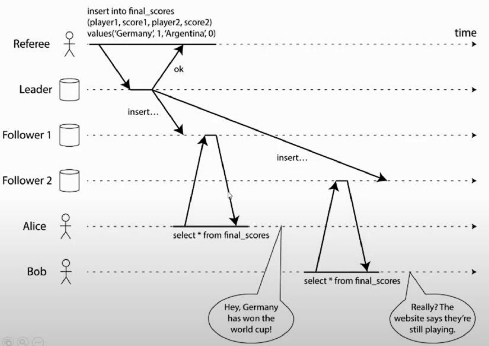

- Реплики могут отставать, соответственно разные клиенты получают разные данные
- Отказы узлов

### CAP теорема

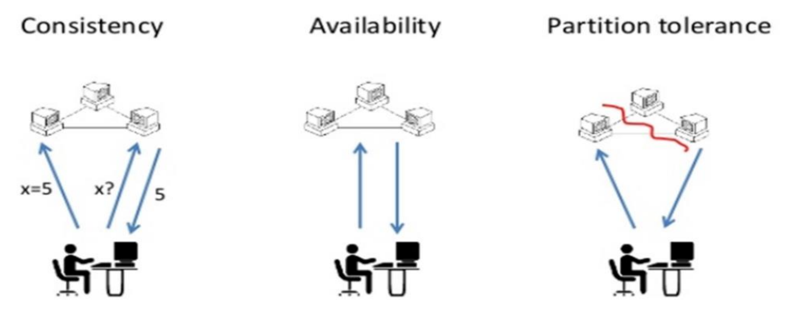

- Согласованность (`Consistency`) – все рабочие узлы содержат одинаковую информацию
- Доступность (`Availability`) – возможность доступа к кластеру, даже если узел в кластере выходит из строя
- Терпимость к разделению сети (`Partition tolerance`) – независимо от сбоев в работе сети узлы продолжают работать

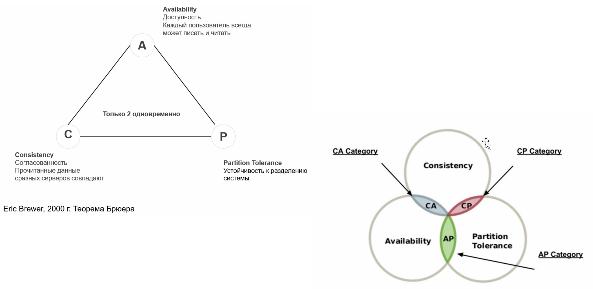

Как видим, есть проблема - полноценно мы можем обладать только двумя качествами (конечно, не надо возводить это в
абсолют)

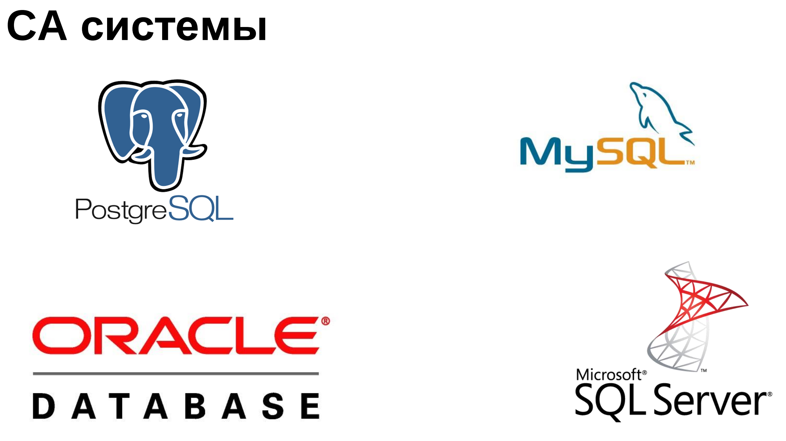

---
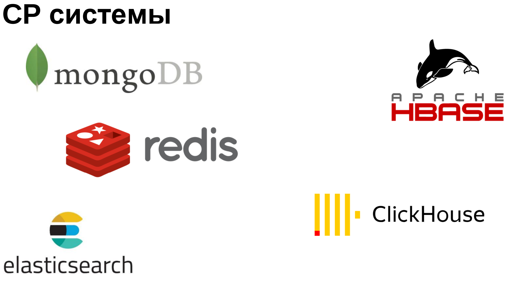

---


### BASE

BASE вместо ACID:

- **Basic Availability** (базовая доступность) – каждый запрос гарантированно завершается
- **Soft state** (гибкое состояние) – состояние системы может изменяться без ввода новых данных для достижения
  согласования данных
- **Eventual consistency** (согласованность в конечном счете) – данные некоторое время могут быть рассогласованные, но в
  итоге приходят к согласованию

### Выбор БД

- SQL:
    - способ взаимодействия - SQL
    - внутри базы - таблицы
    - транзакции, ACID
    - не масштабируемы (или плохо масштабируемые)
- noSQL:
    - способ взаимодействия – поиск по ключам
    - внутри базы – key-value или JSON или граф и прочее
    - нет ACID
    - масштабируемость
- newSQL:
    - способ взаимодействия – SQL
    - внутри базы – таблицы, JSON
    - поддержка свойств ACID
    - масштабируемость

Кажется, что newSQL - это швейцарский нож, но есть свои проблемы

## Архитектура Postgres

PostgreSQL (часто называемый "Postgres") - это мощная реляционная СУБД, которая имеет открытый исходный код и широко
используется в различных приложениях, включая крупные веб-приложения и корпоративные системы управления данными.
PostgreSQL был создан на базе языка программирования Си и имеет модульную архитектуру, которая позволяет расширять
функциональность системы через дополнительные модули.

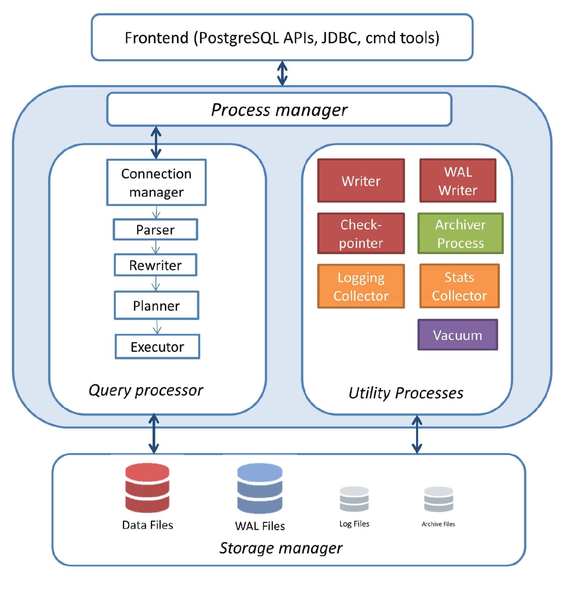

Архитектура PostgreSQL разделяет функциональность СУБД на три основных компонента:

- **Query processor**
- **Utility processes**
- **Storage manager**

### Компоненты query processor

- **Process manager** - управляет запросами, поступающими от клиентов, и запускает необходимые процессы для выполнения
  запроса
- **Parser** - преобразует запрос, написанный на языке SQL, во внутреннее представление, понятное PostgreSQL
- **Rewriter** - оптимизирует запрос и заменяет некоторые части запроса на более эффективные альтернативы
- **Planner** - определяет наилучший план выполнения запроса, используя статистическую информацию о данных в таблицах
- **Executor** - выполняет запрос, используя план, выбранный планировщиком

### Компоненты utility processes

- **Writer** - записывает изменения в таблицы на диск
- **WAL Writer** - записывает информацию о транзакциях в WAL (Write Ahead Log) файлы на диск, что позволяет восстановить
  базу данных в случае сбоя
- **Check-pointer** - удаляет устаревшие данные из файлов WAL, что позволяет уменьшить размер WAL файлов и сократить
  время восстановления базы данных
- **Archiver Process** - архивирует WAL файлы для использования при восстановлении базы данных в случае сбоя
- **Logging collector** - собирает и хранит информацию о работе PostgreSQL для анализа и отладки.
- **Stats collector** - собирает статистику о запросах и использовании системных ресурсов, которая может быть
  использована для оптимизации запросов и настройки сервера
- **Vacuum** - выполняет очистку таблиц от удаленных строк, что позволяет уменьшить размер таблиц и ускорить запросы

### Компоненты storage manager

- **Data files** - файлы данных, в которых хранятся таблицы и индексы.
- **WAL files** - файлы, в которых записываются все изменения в базе данных.
- **Log files** - файлы журналов, в которых хранятся сообщения об ошибках и другие системные сообщения.
- **Archive files** - файлы архива, которые содержат резервные копии базы данных.

Каждый компонент storage manager отвечает за хранение определенного типа данных. Data files хранят таблицы и индексы,
WAL files хранят информацию о транзакциях, Log files хранят сообщения об ошибках и другие системные сообщения, а Archive
files содержат резервные копии базы данных.

В PostgreSQL, таблицы и индексы хранятся в отдельных файлах в специально организованной файловой системе, называемой "
шарнуемой буферной кэш-памятью". Когда данные запрашиваются из таблицы или индекса, они загружаются в буферную
кэш-память, чтобы ускорить доступ к данным в будущем. Если данные не помещаются в буферную кэш-память, они извлекаются
непосредственно из файла данных на диске.

WAL files являются ключевым компонентом для обеспечения надежности и целостности базы данных в PostgreSQL. Когда
транзакция записывается в базу данных, изменения записываются сначала в WAL files, а затем в файлы данных. Это позволяет
восстановить базу данных в случае сбоя, используя информацию из WAL files.

Log files содержат сообщения об ошибках и другие системные сообщения, которые могут быть полезны для отладки и анализа
работы PostgreSQL. Лог-файлы могут быть настроены для записи различных уровней сообщений, включая сообщения отладки,
информационные сообщения, предупреждения и сообщения об ошибках.

Archive files содержат резервные копии базы данных, которые могут быть использованы для восстановления базы данных в
случае сбоя или других проблем. Резервные копии могут быть созданы вручную или автоматически с помощью планировщика
заданий.

В целом, архитектура PostgreSQL очень гибкая и позволяет настраивать систему в соответствии с требованиями приложения.
PostgreSQL имеет широкие возможности для настройки и оптимизации производительности, что позволяет использовать систему
в самых разных сценариях.
