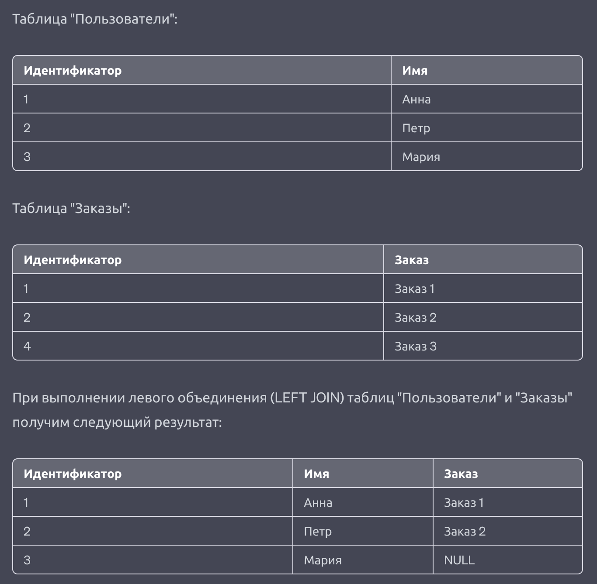

## DML: Вставка, обновление, удаление, выборка

[К оглавлению...](/README.md)

### Соединение таблиц

- **CROSS JOIN**
- **INNER JOIN**
- **OUTER JOIN**
  - **LEFT JOIN**
  - **RIGHT JOIN**
  - **FULL JOIN**

##### CROSS JOIN

##### INNER JOIN

##### LEFT JOIN

##### RIGHT JOIN

##### FULL JOIN

#### Условия соединения

- **ON** - задает выражение логического типа, по аналогии с WHERE. Строки из таблиц соответствуют друг другу, если
  выражение ON возвращает для них true.
- **USING** - сокращенная запись условия, применяется когда с обеих сторон соединения столбцы имеют одинаковые имена (
  исключается избыточность столбцов).
- **NATURAL** - сокращённая форма USING: образует список USING из всех имен столбцов, существующих в обеих входных
  таблицах. Если столбцов с одинаковыми именами нет, то выполняется декартово произведение строк.

#### Возможные варианты в операторе where

- >, <, =, != или <>
- BETWEEN начало AND конец диапазона (с включением!)
- IS NULL или IS NOT NULL
- [поле] [оператор] ANY|SOME|ALL (подзапрос)
- AND OR
- IN
- EXISTS
- LIKE
- SIMILAR TO
- Регулярные выражения
