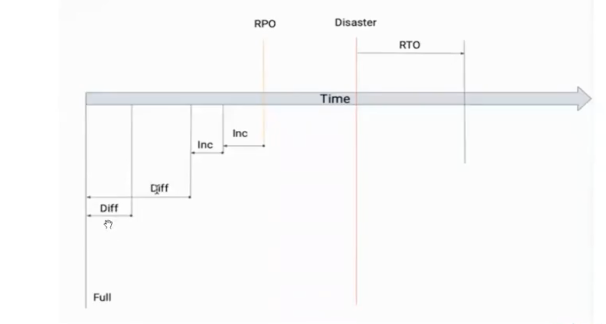

## DML: Вставка, обновление, удаление, выборка

[К оглавлению...](/README.md)

**Бэкап** - это точная копия базы на какой-то момент времени  
**Реплика** - это уже лучше, это копия базы, которая просто немного отстает от мастера

- Не хранить бэкап на том же сервере, что и сервер базы
- Бэкап можно и нужно делать автоматически
- Бэкап - это нагрузка на работающую систему

---

Термины
- **RTO** (Recovery Time Objective) - сколько времени нужно на восстановление резервной копии
- **RPO** (Recovery Point Objective) - точка во времени, на которую должны быть восстановлены данные
- **Backup Level** - уровень резервного копирования
  - 0 - **Full** - это полный бэкап. Postgres только его предоставляет. Другие нет
  - 1 - **Differential** - копируется только то, что изменилось с последнего полного (Full) копирования. Full + разница
  - 2 - **Incremental** - с последнего бэкапа (любого из этих трех)
- **Глубина резервного копирования** - как долго хранить копии

---

Виды бэкапов

- Логическое
  - Можно сделать копию отдельного объекта
  - Можно восстановиться вообще на другой версии postgres
  - Можно восстановиться вообще на другой архитектуре
  - Низкая скорость
  - Делается легко с помощью запроса. Сохраняется в файл. Смотри гугл

- Физическое
  - Высокая скорость относительно логического вида

---

остановился на 33 минуте
