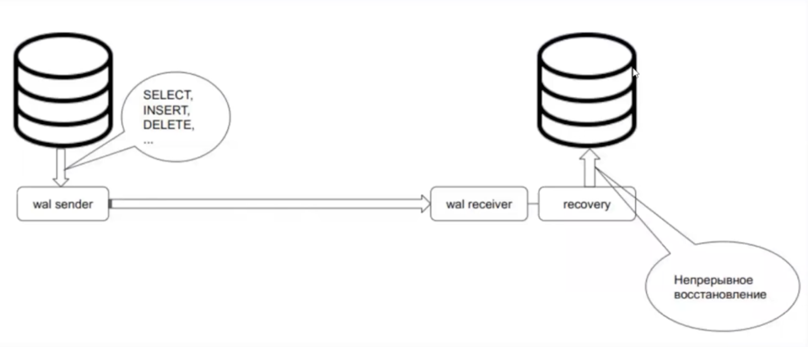

## Репликация

[К оглавлению...](/README.md)

Бэкап - хорошо, но нужно время на его развертку
Бэкап лучше делать с реплики, чтобы не нагружать мастер
Репликация - процесс синхронизации нескольких копий одного объекта

Для чего репликация

- обеспечить высокую доступность - можно переключиться с мастера на реплику, когда мастеру плохо
- масштабируемость (отдельные реплики на чтение и запись)
- геораспределение нагрузки

---

Виды

- **Физическая**
    - по сути создается кластер реплику и настраиваем перенос wal файлов на реплику. Эти wal файлы
      проигрываются на реплике - так и получаем синхронизацию
    - это точная копия мастера (одна версия сервера, одна и та же архитектура, одна и та же платформа)
    - доступна только для чтения
- Применение
    - Горячий резерв для высокой доступности
    - Балансировка нагрузки (метрики и прочее)
    - Несколько реплик и каскадная репликация (реплика реплицируется с мастера) - не часто, но встречается
    - Отложенная репликация
- Возможности
    - запросы на чтение
    - установка параметров
    - управление транзакциями (begin, commit...)
    - создание бэкапа
- Ограничения
    - любые изменения (insert, update...)
    - блокировки (select for update)
    - команды DDL (create, drop...)
    - команды сопровождения (vacuum, analyze, reindex...)
    - управление доступом (grant, revoke...)
    - не срабатывают триггеры и пользовательские блокировки
- Необычное
    - когда мастер распухает без причин, надо обратить внимание на реплику. Если там есть процесс -
      hot_standby_feedback - удерживание версии строки в мастере, автовакуум в мастере не работает и мастер пухнет

Процессы
  - мастер
    - wal sender
    - archiver
    - checkpointer
    - stats collector
    - wal writer
    - autovacuum
  - реплика
    - wal sender
    - archiver
    - checkpointer
    - stats collector

Виды физической репликации
  - **асинхронная** - мастер не ждет фиксации на репликах
    - плюсы
      - быстрая БД
    - минусы
      - реплика отстает
  - **синхронная** - мастер ждет реплику
    - плюсы
      - мастер и слейв (реплика) идентичны
    - минусы
      - производительность хуже
      - если реплика упала - мастер тоже стоит, ждет реплику

Для синхронной реплики можно выбрать событие, после которого можем считать, что можно не ждать мастер (synchronous_commit):
- remote_write - дожидаемся ответа, что информация дошла до реплики, но не факт, что записалась
- on - произошла запись на WAL файл
- remote_apply - запись применена в базе

---

- **Логическая**
    - позволяет делать на уровне таблиц (например полезно для аналитики, когда нужна только одна таблица). Не
      копируются DDL команды
    - 
 

-- остановился на 25 минуте
