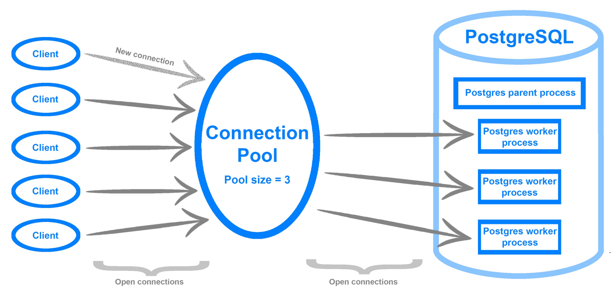
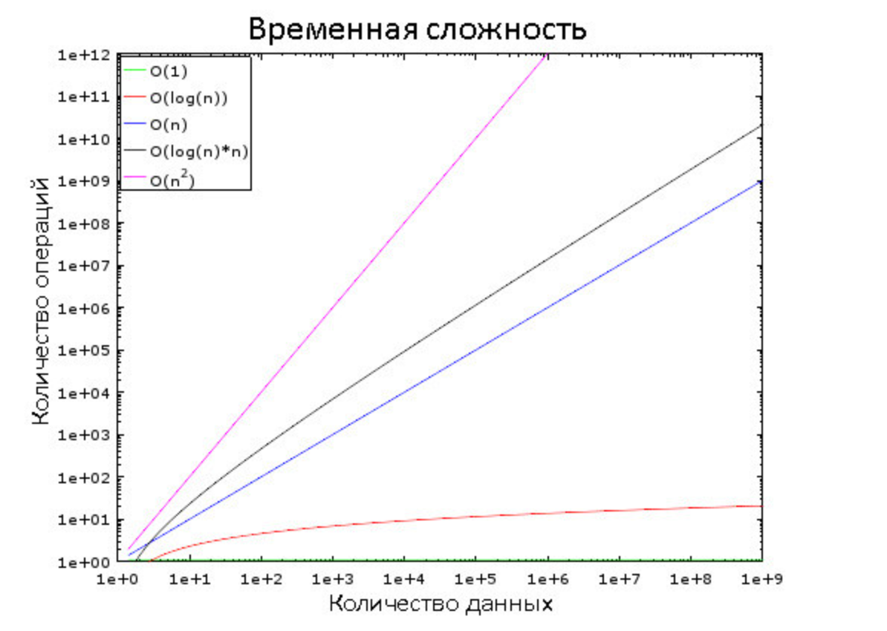

## Виды СУБД

СУБД (системы управления базами данных) можно разделить на 2 основные категории: SQL и NoSQL.

### SQL

SQL (Structured Query Language) СУБД хранят данные в таблицах со строго определенными столбцами и типами данных.
Поддерживаются связи между таблицами и высокоуровневые операции запросов.

### NoSQL

NoSQL (Not Only SQL) СУБД не используют таблицы и не имеют строгих ограничений на структуру данных. Они часто
используются для обработки больших объемов данных и имеют высокую гибкость.

### Особенности

SQL-базы данных используют реляционную модель данных, где данные хранятся в таблицах с фиксированными столбцами и
строками. Они поддерживают ACID-свойства (атомарность, целостность, изолированность и доступность) и предлагают высокую
степень контроля данных.

NoSQL-базы данных используют нереляционные модели данных, такие как документы, ключ-значение или графы. Они обеспечивают
гибкость и скорость в управлении данными, а также поддерживают высокую масштабируемость и доступность данных. Однако,
они не всегда поддерживают ACID-свойства.


## Основы работы с БД

[К оглавлению...](/README.md)

Для начала работы нужно:

- Подключиться к базе
- Подтвердить свои права доступа

Подключение клиентов к БД:

- у каждого клиента своё соединение
- у каждого соединения свой процесс
- выгоднее всего, когда соединений мало, но при этом они живут долго

Пул соединений с БД:

- даёт переиспользовать соединения



Получить список соединений:

```sql
SELECT
  state,
  query
FROM 
  pg_stat_activity
WHERE 
  state IS NOT NULL;
```

- `active` — соединение прямо сейчас что-то делает
- `idle` — соединение открыто и ожидает запросы
- `idle in transaction` — соединение открыто в режиме транзакции

Как раздавать права:

- создаём роль "Аналитика" (к примеру, умеет только читать)
- создаём роль "API" (умеет записывать и читать)<br>
  Выигрыш: если нужно изменить права — вносим правки в одном месте

Принцип минимальных привилегий:

- по умолчанию запрещаем всё
- открываем только нужные доступы


## Как работают реляционные базы данных

[К оглавлению...](#Содержание)

### Временная сложность

Временная сложность - это мера количества времени, необходимого для выполнения определенного алгоритма или решения
задачи.

Временная сложность может быть выражена в терминах "O-нотации" (большое "О"). О-нотация описывает, как быстро растет
время выполнения алгоритма при увеличении размера входных данных. Например, алгоритм со временной сложностью O(1) будет
выполняться за постоянное время, в то время как алгоритм с временной сложностью O(n^2) будет выполняться за время,
пропорциональное квадрату размера входных данных.

Здесь важен не объём данных, а динамика увеличения количества операций с ростом объёма. Временная сложность не позволяет
вычислить точное количество, но зато представляет собой хороший способ оценки.



### Сортировка слиянием

Сортировка слиянием - это алгоритм сортировки, который использует метод "разделяй и властвуй". Алгоритм сортировки
слиянием позволяет эффективно сортировать массивы любого размера.

Преимущества:

- Гарантированная сложность O(n log n) - время работы алгоритма не зависит от расположения элементов в массиве.
- Устойчивость - порядок равных элементов не меняется.
- Эффективность на больших объемах данных - сортировка слиянием позволяет эффективно сортировать массивы любого размера.

Выполняется двумя фазами:

#### Фаза деления

  

В три этапа исходный массив делится на подмассивы, состоящие из одного элемента. Вообще, количество этапов деления
определяется как log(N) (в данном случае N=8, log(N) = 3). Идея в том, чтобы на каждом этапе делить входящие массивы
пополам. То есть описывается логарифмом с основанием 2

#### Фаза сортировки

  

Здесь происходит обратная операция, объединение массивов с двукратным увеличением их размеров. Для этого требуется
проделать на каждом этапе по 8 операций.

1. Сначала в них сравниваются имеющиеся элементы
2. Наименьший из них переносится в новый массив
3. Происходит возврат в тот массив, откуда был взят предыдущий элемент
4. Шаги 1-3 повторяются до тех пор, пока в одном из исходных массивов не останется лишь один элемент
5. После этого из второго массива переносятся все оставшиеся элементы

```js
function mergeSort(arr) {
    if (arr.length <= 1) {
        return arr;
    }

    const middle = Math.floor(arr.length / 2);
    const left = arr.slice(0, middle);
    const right = arr.slice(middle);

    return merge(mergeSort(left), mergeSort(right));
}

function merge(left, right) {
    const result = [];

    while (left.length && right.length) {
        if (left[0] <= right[0]) {
            result.push(left.shift());
        } else {
            result.push(right.shift());
        }
    }

    while (left.length) {
        result.push(left.shift());
    }

    while (right.length) {
        result.push(right.shift());
    }

    return result;
}
```

Данный алгоритм хорошо работает лишь потому, что оба исходных массива были заранее отсортированы, поэтому ему не нужно
возвращаться в их начало во время очередной итерации.

https://habr.com/ru/company/vk/blog/266811/
