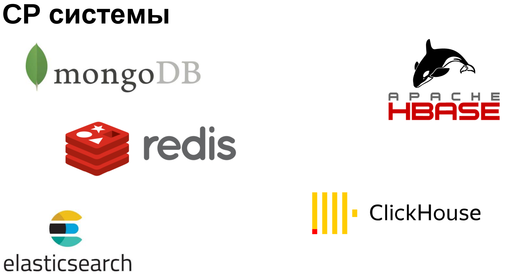

## Теорема CAP

[К оглавлению...](#Содержание)

### Транзакция

Транзакция - это последовательность операций, рассматриваемая базой данной как атомарное действие и завершающаяся
подтверждением изменений (`commit`) либо откатом изменений (`rollback`).

Транзакция обеспечивает:

- сохранение целостности данных
- параллельную работу пользователей с базой данных
- восстановление данных при откатах и сбоях

#### Системные столбцы транзакций

- **xmin** - Идентификатор транзакции, добавившей строку этой версии
- **cmin** - Номер команды (начиная с нуля) внутри транзакции, добавившей строку.
- **xmax** - Идентификатор транзакции, удалившей строку, или 0 для неудалённой версии строки.
- **cmax** - Номер команды в удаляющей транзакции или 0.
- **ctid** - Cсылка на следующую, более новую, версию той же строки. У самой новой, актуальной, версии строки ctid
  ссылается на саму эту версию. Номер имеет вид (x,y), где x — номер страницы, y — порядковый номер указателя в массиве

#### Vacuum. autovacuum. vacuum full

- **vacuum** - высвобождает пространство, занимаемое «мёртвыми» кортежами – отмечает занимаемое ими место, как
  свободное. Не требует исключительной блокировки;
- **vacuum full** – переписывает содержимое таблицы в НОВЫЙ файл, не содержащий «мертвых» версий, т.е. дисковое
  пространство освобождается. Работает намного медленнее и блокирует таблицу;
- в большинстве случаев не требуется запуск vacuum «вручную», с этой задачей справляется autovacuum (использует средства
  сбора статистики для получения информации об использовании таблиц)

Autovacuum можно настраивать. Для этого надо переопределить переменные его конфигурации (log_autovacuum_min_duration,
autovacuum_max_workers и т.д.)

### ACID

- `Atomicity` (Атомарность) - либо все изменения транзакции фиксируются (commit), либо все откатываются (rollback).
- `Consistency` (Согласованность) - требует, чтобы транзакция переводила БД из согласованного состояния в столь же
  согласованное
- `Isolation` (Изолированность) - работающие одновременно транзакции не влияют друг на друга.
- `Durability` (Долговечность) - если транзакция была успешно завершена, то никакое внешнее событие не должно привести к
  потере совершенных ей изменений.

#### Изолированность. Аномалии параллельного доступа

- **Грязное чтение** (dirty read) – транзакция читает данные, записанные другой транзакцией, которая на момент чтения не
  была зафиксирована (возможен откат)
- **Неповторяемое чтение** (non-repeatable read) – транзакция читает одни и те же данные несколько раз, получая
  различные результаты, т.к. данные изменяются другими транзакциями
- **Фантомное чтение** (phantom read) - Транзакция повторно выполняет запрос, возвращающий набор строк для некоторого
  условия, и обнаруживает, что набор строк, удовлетворяющих условию, изменился из-за транзакции, завершившейся за это
  время
- **Аномалия сериализации** (serialization anomaly) - аномалия параллельного доступа в базах данных, которая возникает,
  когда две или более транзакции параллельно работают с данными в базе и нарушается свойство изоляции транзакций. В
  результате возникает ситуация, когда результат выполнения транзакций зависит от порядка их выполнения, что
  противоречит концепции сериализуемости транзакций.

##### Уровни изоляции

- **Read uncommited** – чтение незафиксированных данных (в PostgreSQL не реализован)
- **Read commited** – чтение только зафиксированных данных
- **Repeatable read** – повторяемое чтение
- **Serializable** - сериализуемость

| Аномалия параллельного доступа                   | Уровень изоляции              |
|--------------------------------------------------|-------------------------------|
| Неповторяемое чтение (Dirty read)                | Read uncommitted              |
| Фантомное чтение (Phantom read)                  | Repeatable read, Serializable |
| Аномалия нескольких чтений (Non-repeatable read) | Repeatable read, Serializable |
| Аномалия потерянного обновления (Lost update)    | Serializable                  |

Уровень изоляции задается в рамках транзакции и зависит от конкретного СУБД. Обычно, для изменения уровня изоляции нужно
использовать специальный оператор или функцию, которые предоставляются конкретной СУБД.

```sql
SET TRANSACTION ISOLATION LEVEL REPEATABLE READ;
```

#### Реализации ACID:

- `ARIES` (Algorithms for Recovery and Isolation Exploiting Semantics) - алгоритмы восстановления систем:
  - `logging` - запись в журнал всех действий транзакции, которые могут изменить состояние БД
  - `checkpoints` - механизм контрольных точек
  - `поддержка` покортежных блокировок
  - асинхронное восстановление страниц базы
  - поддержка разделенного запуска (сначала важная информация, потом все остальное)

- `MVCC` (MultiVersion Concurrency Control) - механизм обеспечения параллельного доступа к БД:
  - каждой сессии предоставляется «снимок» БД
  - изменения в БД невидимы другим пользователям до момента фиксации транзакции
  - читатели не блокируют читателей
  - читатели не блокируют писателей
  - писатели не блокируют читателей
  - читатели блокируют только читателей

На картинке показано, как работает MVCC. Транзакция делает снимок БД на момент своего запуска (то есть имеет свою версию
БД) и читает только с него


Преимущества MVCC:

- без блокировок

В большинстве современных баз данных, поддерживающих ARIES или MVCC, эти методы включены по умолчанию. Чтобы включить
ARIES или MVCC в базе данных, необходимо убедиться, что ваша база данных поддерживает соответствующий метод управления
транзакциями и выполнить настройку соответствующих параметров.

### Проблемы распределенных систем


- Реплики могут отставать, соответственно разные клиенты получают разные данные
- Отказы узлов

### CAP теорема


- Согласованность (`Consistency`) – все рабочие узлы содержат одинаковую информацию
- Доступность (`Availability`) – возможность доступа к кластеру, даже если узел в кластере выходит из строя
- Терпимость к разделению сети (`Partition tolerance`) – независимо от сбоев в работе сети узлы продолжают работать


Как видим, есть проблема - полноценно мы можем обладать только двумя качествами (конечно, не надо возводить это в
абсолют)


---


---


### BASE

BASE вместо ACID:

- **Basic Availability** (базовая доступность) – каждый запрос гарантированно завершается
- **Soft state** (гибкое состояние) – состояние системы может изменяться без ввода новых данных для достижения
  согласования данных
- **Eventual consistency** (согласованность в конечном счете) – данные некоторое время могут быть рассогласованные, но в
  итоге приходят к согласованию

### Выбор БД

- SQL:
  - способ взаимодействия - SQL
  - внутри базы - таблицы
  - транзакции, ACID
  - не масштабируемы (или плохо масштабируемые)
- noSQL:
  - способ взаимодействия – поиск по ключам
  - внутри базы – key-value или JSON или граф и прочее
  - нет ACID
  - масштабируемость
- newSQL:
  - способ взаимодействия – SQL
  - внутри базы – таблицы, JSON
  - поддержка свойств ACID
  - масштабируемость

Кажется, что newSQL - это швейцарский нож, но есть свои проблемы
